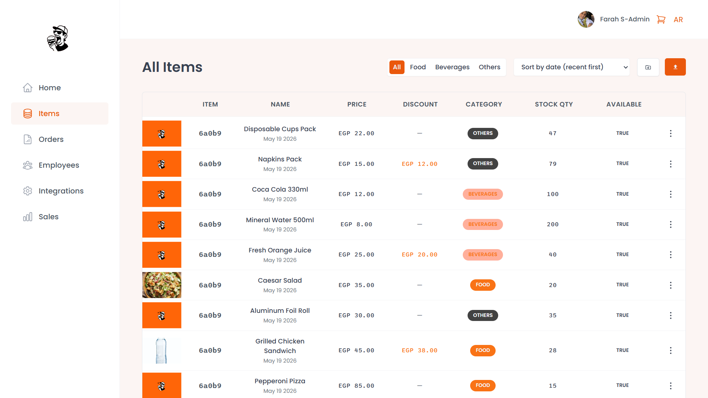
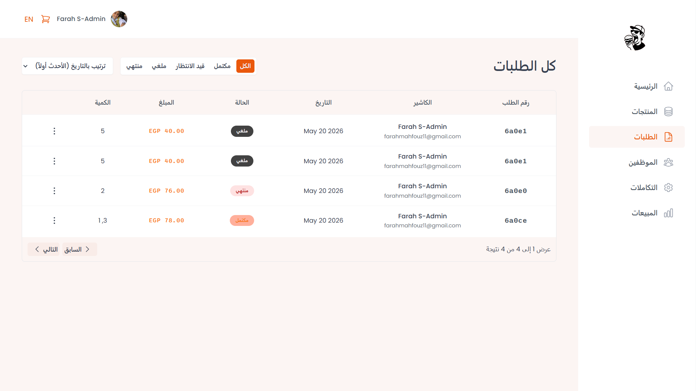
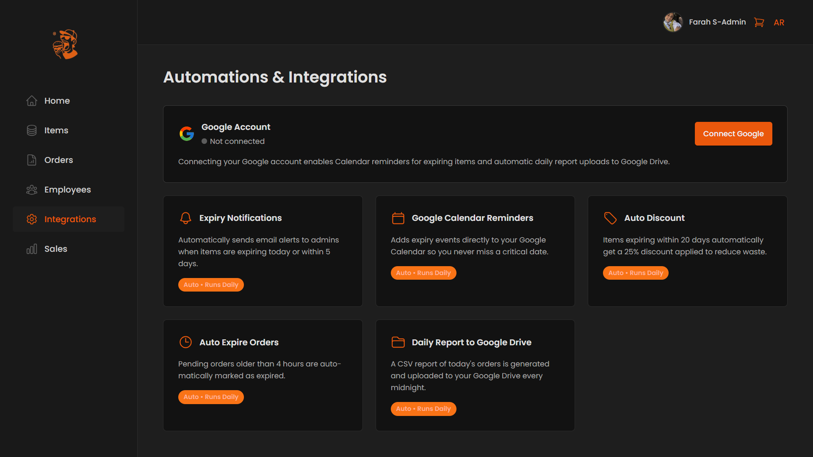

# Order Management System — Frontend Documentation

Documentation for the **Order Management System Frontend** (React + Vite). Connects to a separate Backend application via REST API.

---

## 1. Overview

The application allows restaurant/store employees to:

| Module | Function |
|--------|---------|
| **Dashboard** | Statistics, sales, today's orders |
| **Items** | View and manage products (add, edit, delete, details) |
| **Orders** | View orders, details, complete/cancel |
| **Cart** | Local shopping cart then confirm order and send to API |
| **Employees** | View employees and create new accounts |
| **Integrations** | Google integration (for authorized users) |
| **Reports** | Sales reports |
| **Account** | Update account info and password |

The **Cart** is stored in the browser (`localStorage`) and not on the server until the user clicks **Confirm order** — then an `Order` is created in the Backend.

---

## 2. Technologies Used

| Technology | Usage |
|---------|-----------|
| **React 18** | User interface |
| **Vite** | Build tool and development server |
| **React Router v6** | Routing and pages |
| **TanStack React Query v4** | Data fetching, caching, page prefetching |
| **Axios** | HTTP requests with `axiosInstance` |
| **styled-components** | Styling (CSS-in-JS) |
| **react-hook-form** | Forms and validation |
| **react-hot-toast** | Success/error notifications |
| **i18next + react-i18next** | Arabic / English + RTL |
| **recharts** | Charts in Dashboard |
| **js-cookie** | JWT storage for authentication |

---

## 3. Local Setup

```bash
# Install packages
npm install

# Run development mode (default: http://localhost:5173)
npm run dev

# Build for production
npm run build

# Preview build
npm run preview
```

### API Setup

The Backend URL is defined in:

`src/services/axiosInstance.js`

```js
const API_URL = `https://order-management-system-apis--farahmmahfouz.replit.app/api/v1/`;
// Or locally:
// const API_URL = `http://localhost:3000/api/v1/`;
```

All protected requests send `Authorization: Bearer <jwt>` from the `jwt` cookie (set on login from the Backend).

---

## 4. Folder Structure

```
src/
├── App.jsx                 # Routes, Providers, Toaster
├── main.jsx
├── i18n.js                 # Translation setup
├── lang/
│   ├── en/lan-en.json
│   └── ar/lan-ar.json
├── context/
│   ├── CartContext.jsx     # Shopping cart + localStorage
│   ├── DarkModeContext.jsx
│   └── LanguageContext.jsx
├── pages/                  # Route pages (thin — assemble features)
├── features/               # Logic per domain (hooks + components)
│   ├── authentication/
│   ├── items/
│   ├── orders/
│   ├── cart/
│   ├── employees/
│   ├── dashboard/
│   ├── integrations/
│   └── reports/
├── services/               # API functions (axios)
│   ├── axiosInstance.js
│   ├── apiAuth.js
│   ├── apiItems.js
│   ├── apiOrders.js
│   ├── apiUsers.js
│   ├── apiGoogle.js
│   └── apiReports.js
├── ui/                     # Shared components (Button, Table, Modal, …)
├── hooks/                  # General hooks
├── styles/
│   └── GlobalStyles.js
└── utils/
    ├── permissions.js      # Role-based permissions
    ├── helpers.js
    └── constants.js
```

## 📸 Screenshots

  
  
  |


### Feature Folder Pattern

Each feature typically contains:

- **`useX.js`** — React Query hook (e.g. `useItems`, `useUsers`, `useOrders`)
- **UI Components** — tables, rows, forms
- **`XTable.jsx` + `XRow.jsx` + `XTableOperations.jsx`** — recurring pattern for lists

The page in `pages/` only assembles elements (Heading + Table + AddButton).

---

## 5. Routes

| Path | Page | Protection |
|--------|--------|--------|
| `/login` | Login | Public |
| `/forgotPassword` | Forgot Password | Public |
| `/reset-password/:token` | Reset Password | Public |
| `/dashboard` | Dashboard | `ProtectedRoute` |
| `/items` | Products list | `ProtectedRoute` |
| `/items/:itemId` | Product details | `ProtectedRoute` |
| `/orders` | Orders | `PermissionRoute` → `orders` |
| `/orders/:orderId` | Order details | `orders` |
| `/employees` | Employees | `users` |
| `/cart` | Cart | `ProtectedRoute` |
| `/integrations` | Integrations | `google` |
| `/reports` | Reports | `reports` |
| `/account` | Account | `ProtectedRoute` |

`ProtectedRoute`: Verifies user via `GET /users/me`.
`PermissionRoute`: Redirects to `/dashboard` if permission is `false`.

---

## 6. Authentication & Permissions

### Login

- `LoginForm` → `useLogin` → `apiAuth.login`
- JWT is saved in a cookie named `jwt`
- `useUser` fetches the current user and is used throughout the app

### Roles & Permissions

File: `src/utils/permissions.js`

| Role | users | itemsWrite | orders | google | reports |
|-------|-------|------------|--------|--------|---------|
| `super_admin` | ✅ | ✅ | ✅ | ✅ | ✅ |
| `manager` | ✅ | ✅ | ✅ | ✅ | ✅ |
| `cashier` | ❌ | ❌ | ✅ | ❌ | ❌ |
| `waiter` | ❌ | ❌ | ❌ | ❌ | ❌ |

- **`usePermissions()`** — returns `permissions` based on `user.role`
- **`MainNav`** — hides links for unauthorized users
- **`Employees.jsx`** — "Add Employee" button only shows with `permissions.users`
- **`Items.jsx`** — "Add Item" button with `permissions.itemsWrite`

---

## 7. Cart

**File:** `src/context/CartContext.jsx`

| Function | Purpose |
|--------|---------|
| `addToCart(item)` | Add or increase quantity |
| `removeFromCart(id)` | Remove item from cart |
| `updateQuantity(id, qty)` | Update quantity |
| `clearCart()` | Empty cart + clear `localStorage` |
| `getTotalCost()` | Total price |
| `getItemsCount()` | Item count (for cart icon badge in Header) |

**Storage:** Key `oms-cart` in `localStorage`.

**Confirm Order:** `CartBox` → `useCreateOrder` → `POST /orders` with `customerName` and `items[]`.

**Cart UI:**

- `CartItem.jsx` — vertical cards (name, price, +/- quantity, delete)
- `CartBox.jsx` — list, total, customer name (required field *), Clear / Confirm buttons

---

## 8. API Layer (Services)

| File | Approximate Endpoints |
|-------|-------------------|
| `apiAuth.js` | `/users/login`, `/users/register`, `/users/me`, `/users/logout`, … |
| `apiItems.js` | `GET/POST/PATCH/DELETE /items`, import/export |
| `apiOrders.js` | `GET/POST /orders`, complete/cancel |
| `apiUsers.js` | `GET /users` (pagination, sort, filter by role) |
| `apiGoogle.js` | Google connection status |
| `apiReports.js` | Sales report data |

### Example: List with pagination

`useItems.js` / `useUsers.js` / `useOrders.js`:

- Read from URL: `?page=1&limit=10&sort=-createdAt`
- Optional filter: `category` (items) or `status` (orders) or `role` (users)
- **Prefetch** for next/previous page to improve speed

Expected Backend response shape (users example):

```json
{
  "status": "success",
  "data": {
    "users": [ ... ]
  },
  "allCounts": 25
}
```

---

## 9. Translations (i18n)

- **Files:** `src/lang/en/lan-en.json`, `src/lang/ar/lan-ar.json`
- **Toggle:** `LanguageToggle` + `LanguageContext` (saves language in `localStorage`)
- **RTL:** When `ar`, sets `document.documentElement.dir = 'rtl'`
- **Usage:** `const { t } = useTranslation();` then `t("cart.empty")`

Keys organized as: `common`, `nav`, `items`, `orders`, `employees`, `cart`, …

---

## 10. Shared UI Components

| Component | Usage |
|---------|-----------|
| `AppLayout` | Sidebar + Header + `<Outlet />` |
| `Table` / `Menus` | Tables with action menus |
| `Modal` | Dialogs (add item/employee) |
| `Form` / `FormRow` | Forms — `required` shows red `*` |
| `Pagination` | Page navigation |
| `Filter` / `SortBy` | Table operations |
| `Spinner` / `Empty` | Loading / no data |
| `Button` / `Input` / `Select` | Basic elements |

---

## 11. Dashboard & Reports

- **Dashboard:** Statistics (`Stat`), today's orders (`TodayOrders`), charts (`SalesChart`, `DurationChart`) with date filter
- **Reports:** `SalesReport` + `useSalesReport` for fetching report data

---

## 12. Providers in `App.jsx`

Wrapping order (outside to inside):

1. `LanguageProvider`
2. `DarkModeProvider`
3. `CartProvider`
4. `QueryClientProvider` (+ React Query Devtools)
5. `BrowserRouter` + `Routes`
6. `Toaster` (react-hot-toast)

---

## 13. Typical Flow: Creating an Order from Cart

```
Items / ItemDetails
    → addToCart (CartContext + localStorage)
    → Header: dot on cart icon (if items exist)
Cart page
    → Edit quantities (CartItem)
    → Enter customer name *
    → Confirm order → POST /orders
    → onSuccess: clearCart()
```

---

## 14. Developer Notes

1. **Do not modify `git config` from scripts** — follow the project's commit policy.
2. When adding a new route: register it in `App.jsx` + `MainNav` + `lan-en.json` / `lan-ar.json` + `permissions.js` if needed.
3. Use **`axiosInstance`** and not `axios` directly for protected endpoints.
4. Data hooks are exported as **named exports** (`export function useItems`).
5. The Backend is separate — make sure the API URL, CORS, and cookies (`withCredentials: true`) are compatible with the running environment.

---

## 15. Quick Links to Key Files

| Topic | File |
|---------|--------|
| Routes | `src/App.jsx` |
| Permissions | `src/utils/permissions.js` |
| Cart | `src/context/CartContext.jsx` |
| Axios | `src/services/axiosInstance.js` |
| Translations | `src/i18n.js`, `src/lang/` |
| Employees | `src/features/employees/`, `src/pages/Employees.jsx` |
| Items | `src/features/items/`, `src/pages/Items.jsx` |

---